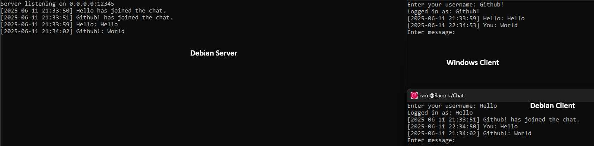
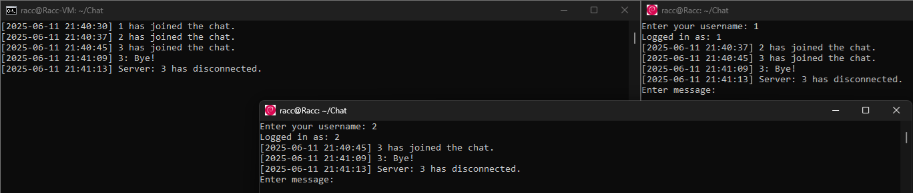

# 🚀 Simple C++ Chat Application (Client & Server)

A **lightweight**, **modern C++20** chat app with no external libraries required (except system libs).  
Cross-platform support for both **Windows** & **Linux**, featuring multi-threaded real-time messaging with username login.  

---

  

---

## ✨ Features

- 🔹 TCP socket-based client-server architecture  
- 🔹 Username login system (simple & effective)  
- 🔹 Multi-threaded message send/receive for smooth UX  
- 🔹 Cross-platform console app with inline backspace support  
- 🔹 Graceful error & disconnect handling  
- 🔹 No external dependencies beyond OS libraries (`pthread` on Linux, `ws2_32` on Windows)  

---

## 🔮 Roadmap & Upcoming Features

- 🎉 **Discord OAuth authentication** *(currently Windows-only)*  
- 🌐 Adding support for other OAuth providers (Google, GitHub, etc.)  
- 🔐 Implementing **end-to-end message encryption**  

---

## ⚙️ Requirements

- **C++20 compatible compiler**  
- **GCC 13+** on Linux/macOS  
- **Visual Studio 2022** with **v143 toolset** on Windows  
- System libraries:  
  - Linux: `pthread`  
  - Windows: Winsock2 (`ws2_32.lib`)  

---

## 🛠️ Build Instructions

### Linux/macOS

```bash
g++ -std=c++20 Client/Client.cpp -o client -lpthread
g++ -std=c++20 Server/Server.cpp -o server -lpthread
```

### Windows

```powershell
cl /std:c++20 /EHsc Client\Client.cpp /link ws2_32.lib
cl /std:c++20 /EHsc Server\Server.cpp /link ws2_32.lib
```

## 📸 Screenshots

### ✅ Multiple Platforms Connected



> Demonstrates a Debian server with clients running on both Debian and Windows. Shows real-time messages and user join notifications.

---

### 👋 User Join/Leave Demonstration



> Shows three users connecting, receiving the welcome message, and a bye message from a client, and then a client disconnection notice.